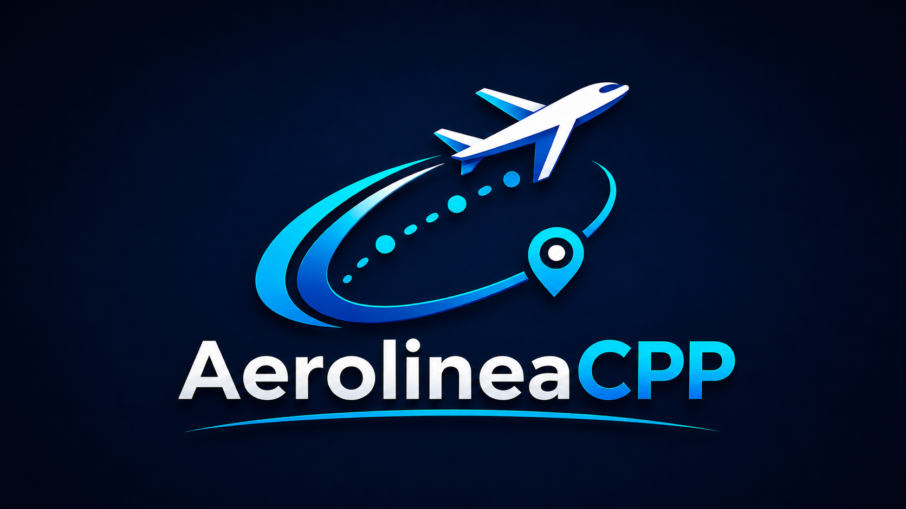

<p align="center">
  
</p>

<p align="center">
  
</p>

<p align="center">
  
  
  
  
  
</p>

<p align="center">
  <strong>C++ · Qt 6 Widgets · SQL Server · CMake · Programación Orientada a Objetos</strong>
</p>

> Estado actual: **Proyecto finalizado, restaurado, modernizado y documentado para portafolio profesional.**

---

## 🧭 Continuidad académica

Estructuras de Datos fue la segunda de tres asignaturas cursadas con el profesor **Raydelto Hernández Perera**, dentro de una evolución progresiva en el desarrollo de software:

| Orden | Asignatura | Proyecto | Período |
|---:|---|---|---|
| 1 | Programación II | [Eventix](https://github.com/Jairo0811/Eventix) | 2017-C2 |
| 2 | Estructuras de Datos | **Aerolinea** | 2018-C1 |
| 3 | Programación WEB | [ITLA Crush](https://github.com/Jairo0811/ITLAcrushReact) | 2018-C2 |

Estos proyectos representan una secuencia académica enfocada en programación, estructuras de datos y desarrollo web. Actualmente están siendo preservados y modernizados como parte del portafolio profesional.

---

## 📌 Descripción

**Aerolinea** es un sistema para la gestión de rutas aéreas desarrollado originalmente como **proyecto final** de la asignatura **Estructuras de Datos (SOF-012)** durante el **cuatrimestre 2018-C1** del **Instituto Tecnológico de Las Américas (ITLA)**.

Ocho años después, el proyecto fue **restaurado y modernizado** con el propósito de preservar el trabajo académico original y demostrar su evolución mediante tecnologías actuales como **Qt 6**, **Microsoft SQL Server**, **CMake** y una arquitectura orientada a objetos.

El repositorio conserva ambas versiones:

- 🕰️ **Legacy (2018-C1)** — aplicación original de consola.
- 🚀 **Modern Qt + SQL Server (2026)** — aplicación de escritorio moderna.

---

## 🎓 Información académica original

| Dato | Información |
|------|-------------|
| 🏛️ Institución | Instituto Tecnológico de Las Américas (ITLA) |
| 📚 Asignatura | Estructuras de Datos |
| 🧾 Código | SOF-012 |
| 👨‍🏫 Profesor | Raydelto Hernández Perera |
| 📅 Período | 2018-C1 |
| 👥 Modalidad | Proyecto Final Grupal |

### 👥 Integrantes del proyecto original

| Integrante | Matrícula |
|------------|-----------|
| Francis Jairo Matías Rosario | 2015-2984 |
| Jorge de Jesús Torres Pérez | 2016-3515 |
| Sebastian Donastor Hernández | 2016-3607 |

---

## 📖 Historia del proyecto

El proyecto nació como una aplicación desarrollada completamente en **C++ para consola**, implementando estructuras de datos mediante listas enlazadas.

En **2026** fue restaurado y modernizado manteniendo la lógica principal, pero incorporando tecnologías actuales para convertirlo en una aplicación de escritorio con persistencia de datos y una arquitectura más mantenible.

La versión moderna incluye funcionalidades que no existían en el proyecto original, sin perder la esencia del desarrollo académico realizado durante el período **2018-C1**.

---

## 🎯 Objetivo

Demostrar la evolución de un proyecto académico hacia una solución moderna mediante la incorporación de:

- 🖼️ Interfaz gráfica con Qt 6.
- 🗄️ Persistencia de datos con SQL Server.
- 📐 Arquitectura orientada a objetos.
- 🏗️ Organización modular del código.
- 🔍 Consultas dinámicas.
- 📈 Mayor escalabilidad y mantenibilidad.

---

## 🏗️ Arquitectura

```text
                    AerolineaCPP

                Qt 6 Widgets (GUI)
                        │
                        ▼
                  MainWindow
                        │
        ┌───────────────┼───────────────┐
        │                               │
        ▼                               ▼
   RutaManager                 DatabaseManager
        │                               │
        ▼                               ▼
Ruta - Vuelo - Destino - Aeronave    SQL Server
```

---

## 🛠️ Stack tecnológico

### 🖥️ Interfaz de escritorio

<p>
  
</p>

- **Qt 6 Widgets:** construcción de la interfaz gráfica de la versión modernizada.
- **Qt Resources:** administración de recursos visuales mediante `resources.qrc`.

### ⚙️ Núcleo y lógica de aplicación

<p>
  
</p>

- **C++17:** lenguaje principal del sistema.
- **Programación orientada a objetos:** organización de entidades, gestores y responsabilidades.
- **Estructuras de datos:** implementación original basada en listas enlazadas.
- **Arquitectura modular:** separación entre interfaz, lógica de rutas y acceso a datos.

### 🗄️ Base de datos y persistencia

<p>
  
  
</p>

- **Microsoft SQL Server:** persistencia de destinos, rutas, aeronaves y vuelos.
- **ODBC Driver 17:** conexión entre la aplicación Qt y SQL Server.
- **Script SQL:** creación y preparación de la base de datos mediante `Aerolinea.sql`.

### 🧰 Compilación y herramientas de desarrollo

<p>
  
</p>

- **CMake:** configuración y automatización del proceso de compilación.
- **Qt Creator:** entorno principal para desarrollar y ejecutar la versión moderna.
- **Git:** control de versiones.
- **GitHub:** alojamiento, documentación y evolución del repositorio.

---

## 📂 Estructura del repositorio

```text
Aerolinea/
│
├── legacy/
│   └── Proyecto original desarrollado en C++ para consola (2018-C1)
│
├── modern-qt-sqlserver/
│   ├── Código fuente Qt
│   ├── Aerolinea.sql
│   ├── resources.qrc
│   ├── CMakeLists.txt
│   └── config/
│       └── database.example.ini
│
├── README.md
└── .gitignore
```

---

## 🕰️ Legacy

La carpeta **legacy** conserva la versión original del proyecto académico.

### Características

- 📋 Gestión básica de destinos.
- 🔗 Implementación mediante listas enlazadas.
- 🖥️ Aplicación de consola.
- 📚 Proyecto original del ITLA.
- 🔧 Código restaurado para mejorar estabilidad y compatibilidad con compiladores actuales.
- 🚫 Prevención de destinos duplicados.
- 🔤 Búsquedas sin distinción entre mayúsculas y minúsculas.

---

## ⚡ Modern Qt + SQL Server

La carpeta **modern-qt-sqlserver** contiene la versión modernizada.

### Funcionalidades

- 🌎 Carga dinámica de destinos desde SQL Server.
- 🛫 Gestión de rutas.
- ✈️ Gestión de aeronaves.
- 🎫 Gestión de vuelos.
- 🔎 Búsqueda inteligente de rutas.
- 🔄 Cálculo automático de escalas.
- 📏 Distancia total.
- ⏱️ Duración total.
- 💵 Precio total del viaje.
- 🛩️ Información del vuelo y aeronave.
- 📋 Ventana "Acerca de".
- 🏛️ Créditos históricos del proyecto.
- 🎨 Interfaz moderna desarrollada con Qt.
- 🖼️ Identidad visual propia de AerolineaCPP.

---

## 🗄️ Base de datos

Tablas principales:

- `Destinos`
- `Rutas`
- `Aeronaves`
- `Vuelos`

Script:

```text
modern-qt-sqlserver/Aerolinea.sql
```

---

## ⚙️ Requisitos

- Windows 10/11.
- Qt 6.11 o superior.
- CMake 3.19 o superior.
- Microsoft SQL Server.
- ODBC Driver 17 for SQL Server.

---

## 🚀 Instalación y configuración

1. Clonar el repositorio:

```bash
git clone https://github.com/Jairo0811/Aerolinea.git
```

2. Abrir en Qt Creator:

```text
modern-qt-sqlserver/
```

3. Ejecutar el script de base de datos:

```text
modern-qt-sqlserver/Aerolinea.sql
```

4. Copiar el archivo de ejemplo:

```text
config/database.example.ini
```

como:

```text
config/database.ini
```

5. Configurar el servidor SQL Server dentro de `database.ini`.
6. Ejecutar **Run CMake**, compilar y ejecutar la aplicación.

> `config/database.ini` contiene la configuración local y no debe subirse al repositorio.

---

## 📈 Evolución del proyecto

| Característica | Legacy (2018-C1) | Modern (2026) |
|:--------------|:----------------:|:-------------:|
| Aplicación de consola | ✅ | ❌ |
| Interfaz gráfica Qt | ❌ | ✅ |
| SQL Server | ❌ | ✅ |
| Persistencia de datos | ❌ | ✅ |
| Arquitectura orientada a objetos | ⚠️ Básica | ✅ |
| Arquitectura modular | ❌ | ✅ |
| Gestión de aeronaves | ❌ | ✅ |
| Gestión de vuelos | ❌ | ✅ |
| Precio total del viaje | ❌ | ✅ |
| Configuración externa de conexión | ❌ | ✅ |
| Ventana "Acerca de" | ❌ | ✅ |
| Identidad visual propia | ❌ | ✅ |

---

## 🚦 Estado del proyecto

**Estado general: ✅ Finalizado**

- [x] Restauración del proyecto original.
- [x] Corrección y estabilización de la versión legacy.
- [x] Modernización con Qt 6.
- [x] Integración con SQL Server.
- [x] Gestión de rutas.
- [x] Gestión de aeronaves.
- [x] Gestión de vuelos.
- [x] Cálculo de distancia.
- [x] Cálculo de duración.
- [x] Cálculo de precio.
- [x] Configuración portable de la conexión.
- [x] Identidad visual propia.
- [x] Documentación.
- [x] Publicación en GitHub.

---

## 📅 Línea de tiempo

| Fecha | Evento |
|--------|--------|
| 🎓 **2018-C1** | Desarrollo del proyecto original para Estructuras de Datos (SOF-012) |
| 🔧 **2026** | Restauración y estabilización del código legado |
| 🚀 **Junio 2026** | Modernización con Qt 6, SQL Server y CMake |
| 📦 **2026** | Finalización y publicación de la versión moderna |

---

## 👨‍💻 Autor de la modernización

**Francis Jairo Matías Rosario**

Restauración, modernización, integración con SQL Server, documentación y preparación para portafolio profesional.
