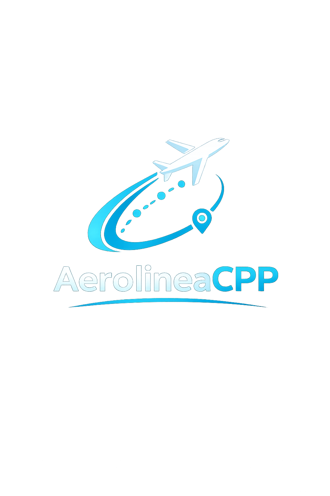

# ✈️ Aerolinea

<p align="center">
  
</p>

<p align="center">
  
</p>

<p align="center">
      
  
  
  
  
</p>

<p align="center">
<strong>C++ · Qt 6 Widgets · SQL Server · CMake · Object-Oriented Programming</strong>
</p>

---

# 📌 Descripción

**Aerolinea** es un sistema para la gestión de rutas aéreas desarrollado originalmente como **proyecto final** de la asignatura **Estructuras de Datos (SOF-012)** durante el **cuatrimestre 2018-C1** del **Instituto Tecnológico de Las Américas (ITLA)**.

Ocho años después, el proyecto fue **restaurado y modernizado** con el propósito de preservar el trabajo académico original y demostrar su evolución mediante tecnologías actuales como **Qt 6**, **Microsoft SQL Server**, **CMake** y una arquitectura orientada a objetos.

El repositorio conserva ambas versiones:

- 🕰️ **Legacy (2018-C1)** — Aplicación original de consola.
- 🚀 **Modern Qt + SQL Server (2026)** — Aplicación de escritorio moderna.

---

# 🎓 Información académica original

| Dato | Información |
|------|-------------|
| 🏛️ Institución | Instituto Tecnológico de Las Américas (ITLA) |
| 📚 Asignatura | Estructuras de Datos |
| 🧾 Código | SOF-012 |
| 👨‍🏫 Profesor | Raydelto Hernández Perera |
| 📅 Período | 2018-C1 |
| 👥 Modalidad | Proyecto Final Grupal |

## 👥 Integrantes del proyecto original

| Integrante | Matrícula |
|------------|-----------|
| Francis Jairo Matías Rosario | 2015-2984 |
| Jorge de Jesús Torres Pérez | 2016-3515 |
| Sebastian Donastor Hernández | 2016-3607 |

---

# 📖 Historia del proyecto

El proyecto nació como una aplicación desarrollada completamente en **C++ para consola**, implementando estructuras de datos mediante listas enlazadas.

En **2026** fue restaurado y modernizado manteniendo la lógica principal, pero incorporando tecnologías actuales para convertirlo en una aplicación de escritorio con persistencia de datos y una arquitectura más mantenible.

La versión moderna incluye nuevas funcionalidades que no existían en el proyecto original, sin perder la esencia del desarrollo académico realizado durante el período **2018-C1**.

---

# 🎯 Objetivo

Demostrar la evolución de un proyecto académico hacia una solución moderna mediante la incorporación de:

- 🖼️ Interfaz gráfica con Qt 6.
- 🗄️ Persistencia de datos con SQL Server.
- 📐 Arquitectura orientada a objetos.
- 🏗️ Organización modular del código.
- 🔍 Consultas dinámicas.
- 📈 Mayor escalabilidad y mantenibilidad.

---

# 🏗️ Arquitectura

```text
                    AerolineaCPP

                Qt 6 Widgets (GUI)
                        │
                        ▼
                  MainWindow
                        │
        ┌───────────────┼───────────────┐
        │                               │
        ▼                               ▼
   RutaManager                 DatabaseManager
        │                               │
        ▼                               ▼
Ruta - Vuelo - Destino - Aeronave    SQL Server
```

---

# 🛠️ Tecnologías utilizadas

| Tecnología | Uso dentro del proyecto |
|------------|-------------------------|
| ⚙️ C++ | Lenguaje principal |
| 🖼️ Qt 6 Widgets | Interfaz gráfica |
| 🗄️ Microsoft SQL Server | Persistencia de datos |
| 🔌 ODBC Driver 17 | Conexión con SQL Server |
| 🏗️ CMake | Sistema de compilación |
| 📐 Programación Orientada a Objetos | Arquitectura del proyecto |
| 🧬 Git / GitHub | Control de versiones |

---

# 📂 Estructura del repositorio

```text
Aerolinea/
│
├── legacy/
│   └── Proyecto original desarrollado en C++ para consola (2018-C1)
│
├── modern-qt-sqlserver/
│   ├── Código fuente Qt
│   ├── Aerolinea.sql
│   ├── resources.qrc
│   └── CMakeLists.txt
│
├── README.md
└── .gitignore
```

---

# 🕰️ Legacy

La carpeta **legacy** conserva la versión original del proyecto académico.

### Características

- 📋 Gestión básica de destinos.
- 🔗 Implementación mediante listas enlazadas.
- 🖥️ Aplicación de consola.
- 📚 Proyecto original del ITLA.
- 🔧 Código restaurado para mejorar estabilidad y compatibilidad con compiladores actuales.

---

# ⚡ Modern Qt + SQL Server

La carpeta **modern-qt-sqlserver** contiene la versión modernizada.

### Funcionalidades

- 🌎 Carga dinámica de destinos desde SQL Server.
- 🛫 Gestión de rutas.
- ✈️ Gestión de aeronaves.
- 🎫 Gestión de vuelos.
- 🔎 Búsqueda inteligente de rutas.
- 🔄 Cálculo automático de escalas.
- 📏 Distancia total.
- ⏱️ Duración total.
- 💵 Precio total del viaje.
- 🛩️ Información del vuelo y aeronave.
- 📋 Ventana "Acerca de".
- 🏛️ Créditos históricos del proyecto.
- 🎨 Interfaz moderna desarrollada con Qt.

---

# 🗄️ Base de datos

Tablas principales:

- Destinos
- Rutas
- Aeronaves
- Vuelos

Script:

```text
modern-qt-sqlserver/Aerolinea.sql
```

---

# ⚙️ Requisitos

- Windows 10/11
- Qt 6.11 o superior
- CMake
- SQL Server
- ODBC Driver 17

---

# 🚀 Instalación

```bash
git clone https://github.com/Jairo0811/Aerolinea.git
```

Abrir:

```text
modern-qt-sqlserver
```

en Qt Creator.

Restaurar la base de datos ejecutando:

```text
Aerolinea.sql
```

Compilar y ejecutar.

---

# 📈 Evolución del proyecto

| Característica | Legacy (2018-C1) | Modern (2026) |
|:--------------|:----------------:|:-------------:|
| Consola | ✅ | ❌ |
| Interfaz Qt | ❌ | ✅ |
| SQL Server | ❌ | ✅ |
| Persistencia de datos | ❌ | ✅ |
| Arquitectura orientada a objetos | ⚠️ Básica | ✅ |
| Gestión de aeronaves | ❌ | ✅ |
| Gestión de vuelos | ❌ | ✅ |
| Precio total del viaje | ❌ | ✅ |
| Ventana "Acerca de" | ❌ | ✅ |

---

# 🚦 Estado del proyecto

- [x] Restauración del proyecto original.
- [x] Modernización con Qt 6.
- [x] Integración con SQL Server.
- [x] Gestión de rutas.
- [x] Gestión de aeronaves.
- [x] Gestión de vuelos.
- [x] Cálculo de distancia.
- [x] Cálculo de duración.
- [x] Cálculo de precio.
- [x] Documentación.
- [x] Publicación en GitHub.

---

# 📅 Línea de tiempo

| Fecha | Evento |
|--------|--------|
| 🎓 **2018-C1** | Desarrollo del proyecto original |
| 🚀 **Junio 2026** | Restauración y modernización con Qt 6 y SQL Server |

---

# 📸 Capturas de pantalla

*(Pendientes de agregar.)*

```text
docs/images/
├── main-window.png
├── search-route.png
└── about.png
```

---

# 🏆 Aprendizajes

Este proyecto permitió aplicar conocimientos de:

- C++
- Qt Framework
- SQL Server
- CMake
- Programación Orientada a Objetos
- Arquitectura modular
- Gestión de recursos Qt
- Integración con bases de datos

---

# 🤝 Créditos académicos

La idea original corresponde al proyecto final desarrollado para la asignatura **Estructuras de Datos (SOF-012)** del **Instituto Tecnológico de Las Américas (ITLA)** durante el período **2018-C1**.

---

# 👨‍💻 Autor de la modernización

**Francis Jairo Matías Rosario**

Restauración del código legado, modernización tecnológica, integración con SQL Server, rediseño de la interfaz, documentación y preparación del proyecto para portafolio profesional.

---

<p align="center">
<b>✈️ De un proyecto académico desarrollado durante el cuatrimestre 2018-C1 a una aplicación moderna con Qt 6 y Microsoft SQL Server en 2026.</b>
</p>
