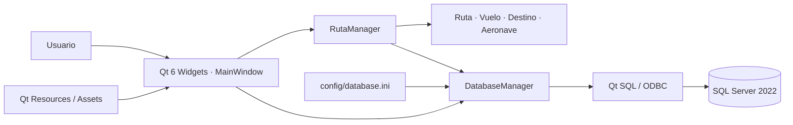
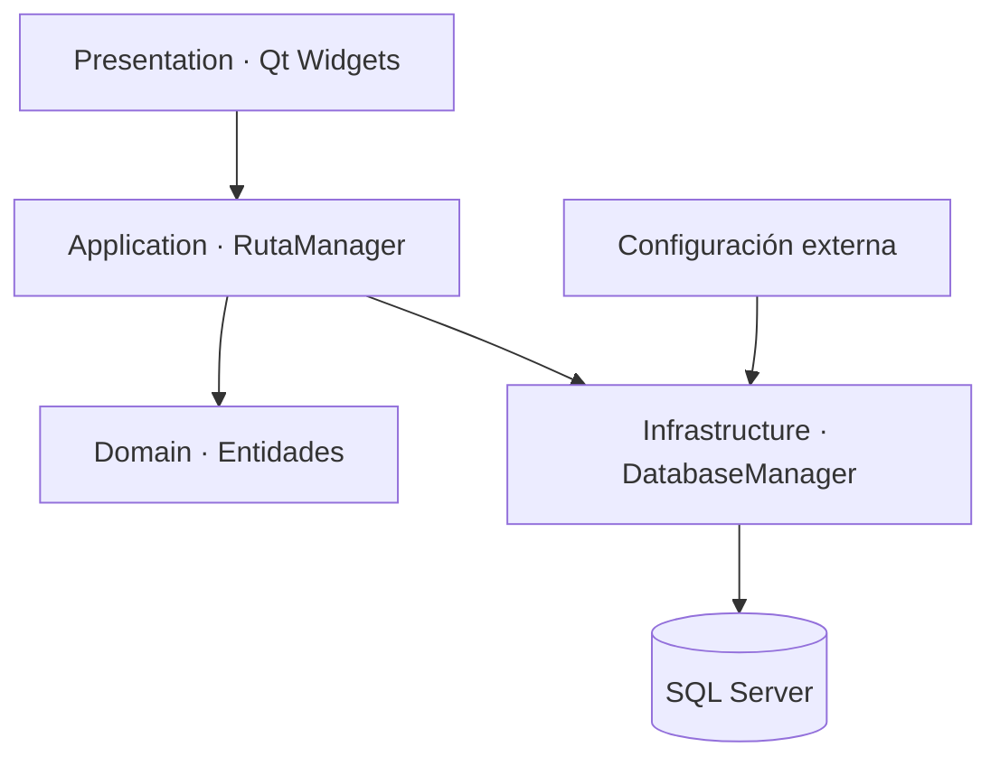
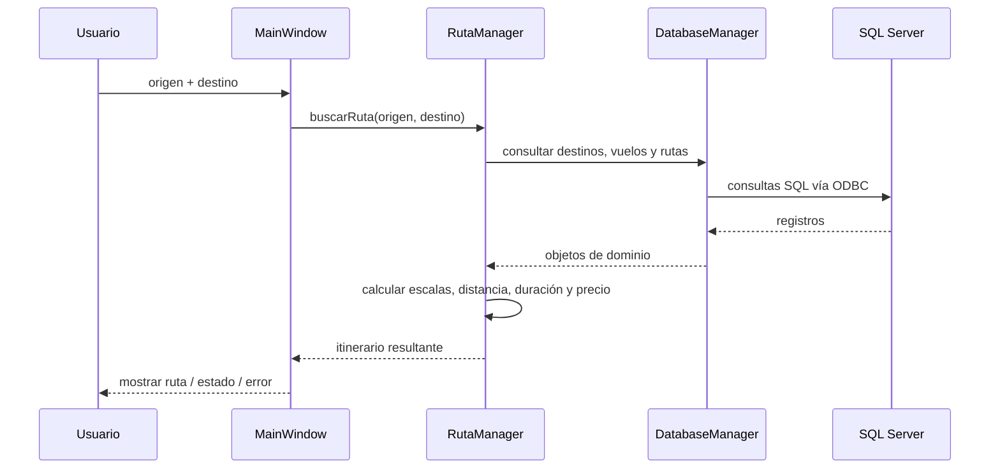
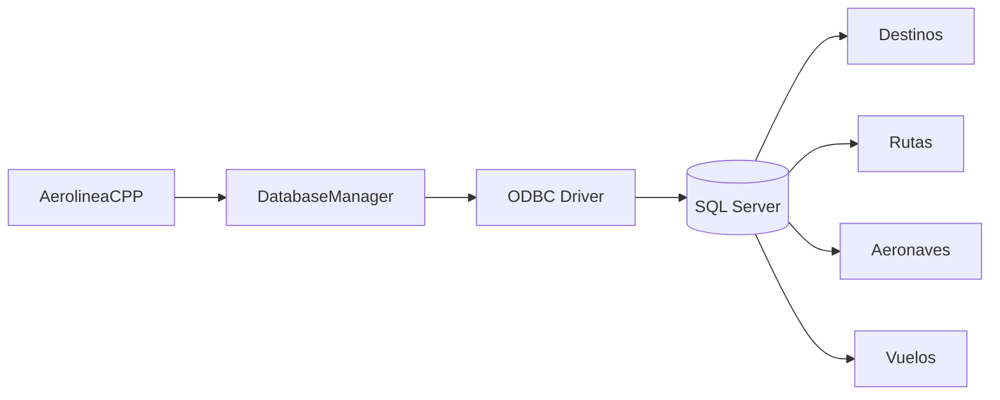
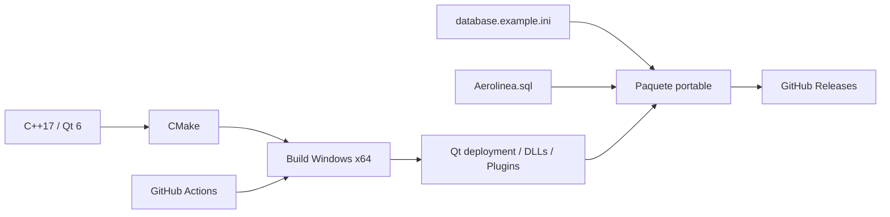
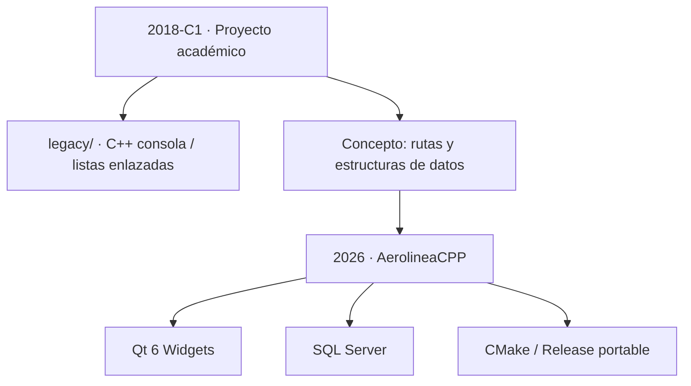

# Arquitectura de AerolineaCPP

Aerolinea conserva dos etapas deliberadamente separadas: el **proyecto académico Legacy de 2018**, basado en consola y listas enlazadas, y la **modernización AerolineaCPP de 2026**, construida con C++17, Qt 6 Widgets y SQL Server. La arquitectura moderna no reemplaza ni altera el valor histórico del código Legacy.

## Vista general de AerolineaCPP

`MainWindow` coordina presentación e interacción. `RutaManager` concentra la lógica de búsqueda y composición de rutas. `DatabaseManager` encapsula la conexión y consultas a SQL Server, evitando que la interfaz manipule directamente detalles de ODBC.

## Separación de responsabilidades

| Componente | Responsabilidad |
|---|---|
| `MainWindow` | Interfaz, comandos, selección de destinos y presentación de resultados |
| `RutaManager` | Búsqueda de rutas directas/con escalas y cálculo agregado del recorrido |
| `Ruta`, `Vuelo`, `Destino`, `Aeronave` | Modelo de dominio de la solución |
| `DatabaseManager` | Apertura de conexión, ejecución de consultas y mapeo de datos |
| `database.ini` | Configuración externa de la instancia SQL Server |
| Qt Resources | Logo, iconos y recursos visuales incluidos en el ejecutable |

## Búsqueda de rutas

La lógica de cálculo se mantiene fuera de la ventana para que la interfaz no sea responsable de construir itinerarios ni sumar métricas del viaje.

## Persistencia

La conexión se configura externamente para evitar acoplar el ejecutable a una instancia específica. Las credenciales locales no deben versionarse.

## Build y distribución

## Relación con Legacy

Legacy y AerolineaCPP comparten contexto académico y concepto funcional, pero permanecen técnicamente separados. Esto permite comparar la evolución del proyecto sin reescribir retrospectivamente el código original.

## Criterio de evolución

La aplicación debe conservar una separación clara entre UI, lógica de rutas y acceso a datos. Nuevas integraciones —por ejemplo APIs aeronáuticas externas— deberían incorporarse como servicios independientes detrás de interfaces, no directamente en `MainWindow`.
